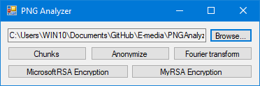
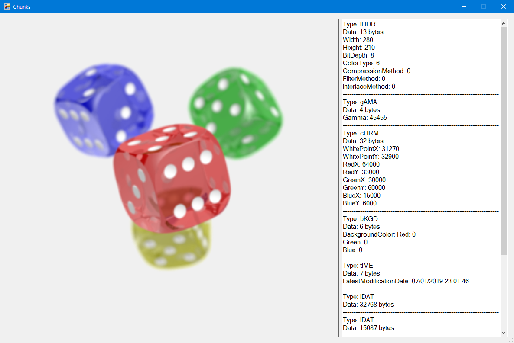
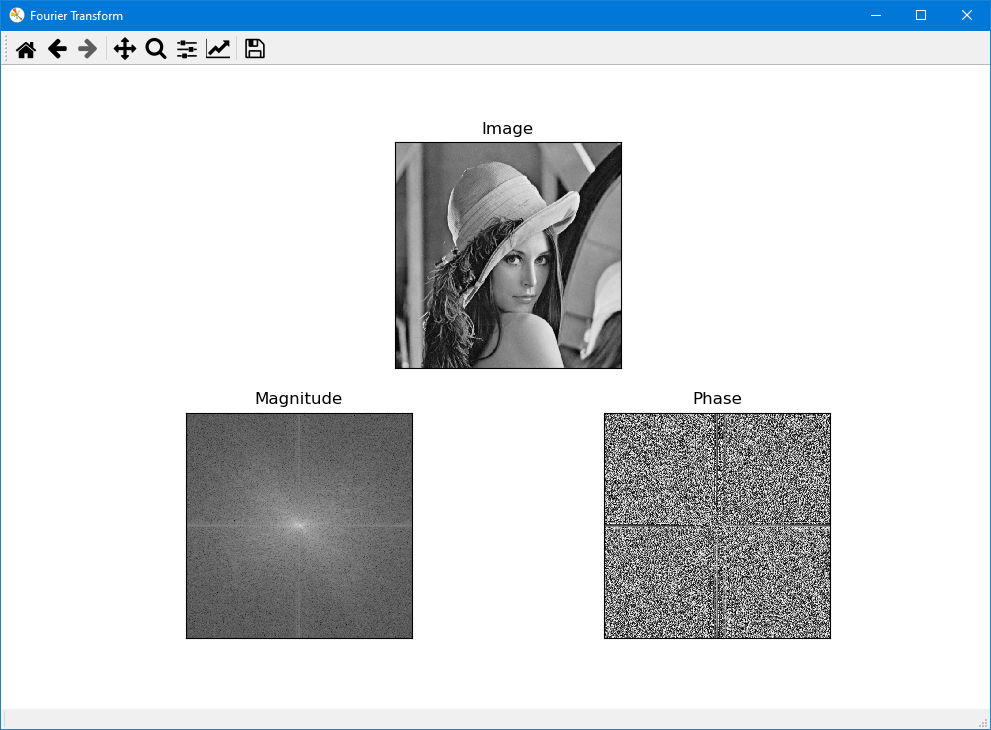

# E-media
E-media course project. The project is focused around PNG images, their structure and
information contained within them.

Main features:
* Displaying information about PNG chunks including EXIF data.
* Anonymizing images by deleting all but critial chunks.
* Displaying Fourier transform of images.

## Authors

* **Agnieszka Ganowicz**
* **Pawel Cembaluk**
* **Bartosz Starosta**

## Built with
* [JetBrains Rider](https://www.jetbrains.com/rider/)
* [JetBrains PyCharm](https://www.jetbrains.com/pycharm/)
* [Sourcetree](https://www.sourcetreeapp.com/)

## Installation

### C# solution
Use PNGAnalyzer.sln to build the whole project.

### Python FourierTransformer
C# part of the project uses an executable created from a Python script to display Fourier 
transform of an image. Easiest way to create this executable is by using 
[Conda](https://docs.conda.io/en/latest/) with provided environment.yml file. Follow
the steps below using the Anaconda Prompt:

1. Create the Conda environment

   ```
   conda env create -f path/to/E-media/PNGAnalyzer/FourierTransform/environment.yml
   ```
   
2. Activate the environment

   ```
   conda activate FourierTransform
   ```

3. Navigate to FourierTransform folder

   ```
   cd path/to/E-media/PNGAnalyzer/FourierTransform
   ```

4. Use pyinstaller (provided in the environment) to create the executable

   ```
   pyinstaller FourierTransform.py
   ```

Done, your program will be now able to display Fourier transforms of your images.

## Screenshots

|  |
|:-------------------------------------------------:|
|  |
|  |
